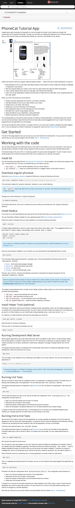

# snappit-mocha-protractor

Many tools feature screenshot support, but default to full-page screenshots. This kills any sort of confidence in running visual regression tests, as the entire page can be filled with content that you don't care about. Much of that content often changes, as well. Why deal with all the noise of false postiives when you could be taking screenshots of just the things you care about?

Sure, there are libraries that support this. But they'll require that you build *yet another* suite of tests in a DSL that must spin up in it's own context, potentially doubling your test runs. Also, how can you interact with your screen and capture the visual content while doing things your customers will do?

This tool uses Selenium, which you probably already have tests for, and integrating it into your existing Protractor test suite is pretty straight forward.

# Install

    npm install --save-dev snappit-mocha-protractor

*protractor.conf.js*

```js
onPrepare: function () {
    screenshot = require('snappit-mocha-protractor');
    screenshot.configure({
        // take two additional screenshots each time `snap` is called
        defaultResolutions: [[1366, 768], [320, 568]],
        threshold: 2 // percent
    });
}
```

*.jshintrc*

    "globals": {
        "screenshot": true
    }

*spec.js*

```js
describe('Angular JS', function () {
    before(function () {
        browser.get('https://angularjs.org');
    });

    it('should be on the right page', function () {
        screenshot.snap(this, $('.center.stage-buttons'), [[1366, 768], [320, 568]]);
        expect(browser.getTitle()).to.eventually.contain('AngularJS');
    });

    describe('Tutorial', function () {

        before(function () {
            $('.dropdown .icon-book').click();
            screenshot.snap(this, $('.dropdown.open .dropdown-menu'));
            element(by.cssContainingText('.dropdown.open a', 'Tutorial')).click();
        });

        it('should have an odd title', function () {
            screenshot.snap(this);
            expect(browser.getTitle()).to.eventually.contain('Tutorial: Tutorial');
        });

    });

});
```

## Testing Responsive Elements

The first call to `screenshot.snap` in the example above contains a list of width/height information. This will resize the screen, then take a screenshot of that element for each resolution passed in.

```js
screenshot.snap(this, $('.center.stage-buttons'), [[1366, 768], [320, 568]]);
```

*1366x768*

.png)

*320x568*

.png)

Finally, we return to the default screen size from the other tests, and take one last screenshot.

*1366x768*

.png)

**Note**: Chrome can only support widths as low as 400px. Firefox can only go as low as 355px.

## A word about Chrome

Chrome screenshots that take up the entire screen are not like Firefox's. Firefox will capture the entire screen, even parts of it that are not currently viewable. Chrome will not!

For example, this is what Firefox reports for a large, full-page screenshot on a tablet.



And the same one on Chrome.


Because of this, and possibly other reasons, taking screenshots with Chrome is *significantly* faster than Firefox.
